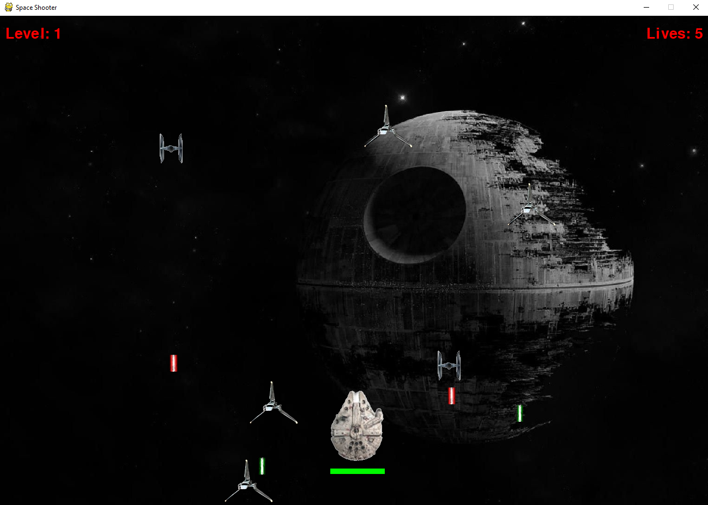
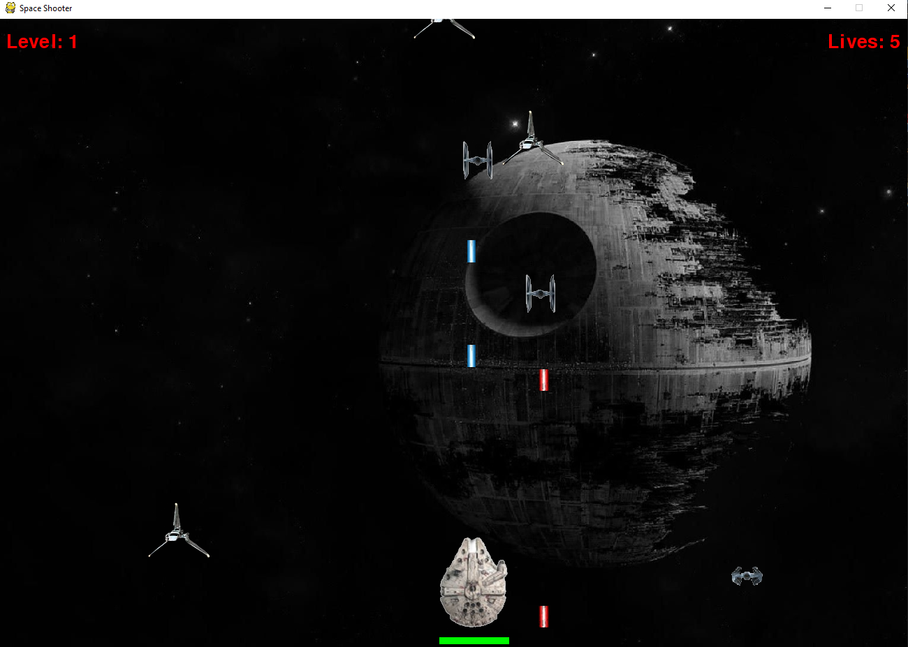

# Space Invider
> Classic game created using python and pygame

## Table of contents
* [General info](#general-info)
* [Screenshots](#screenshots)
* [Technologies](#technologies)
* [Setup](#setup)
* [Features](#features)
* [Status](#status)
* [Inspiration](#inspiration)
* [Contact](#contact)

## General info
Arcade game in which player commands a space ship and fights with Imperial fleet. Player has 5 lives and a health bar, game has increasing difficulty level with many levels to progress through. It has been created using pygame.

## Screenshots

## Technologies
* Python - version 3.7
* Pygame

## Setup
To run this project download the files and run the code in any interpreter. Move your ship using WSAD and shoot with "Sprace".

## Features
List of features ready and TODOs for future development:
* Levels and progressive difficulty
* Health bar and "lives" system
* Collisions system
* Ememies movement in both axes

To-do list:
* Improve the graphics
* Adjust rate of fire for enemies
* Improve enemies movement 

## Status
Project finished

## Inspiration
Inspired by youtube channel: Tech With Tim

## Contact
[@Piotr Kowalewski](https://pkow.herokuapp.com) - feel free to contact me!
